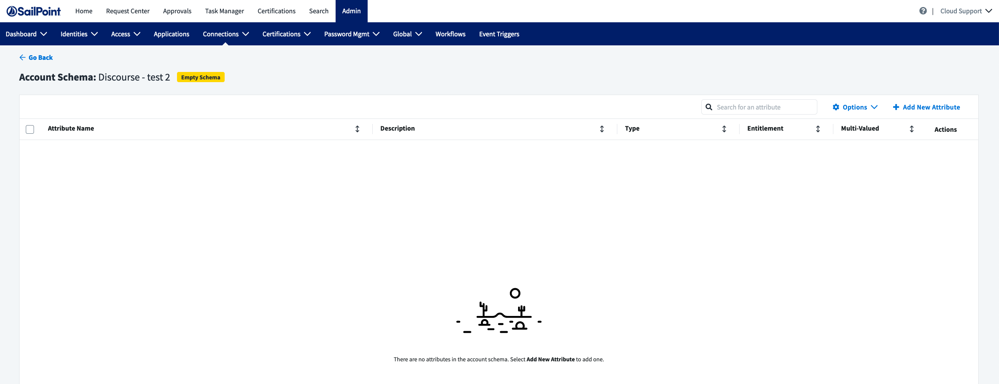
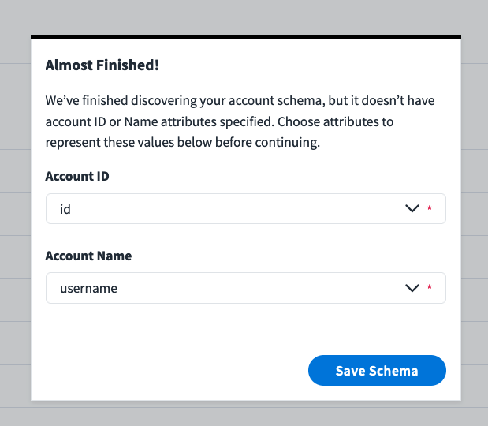
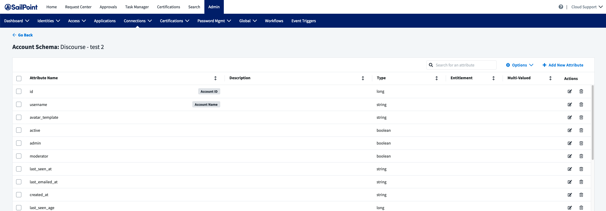

| Input/Output |        Data Type        |
| :----------- | :---------------------: |
| Input        |        undefined        |
| Output       | StdTestConnectionOutput |

### Example StdTestConnectionOutput

```javascript
{
    "displayAttribute": "id",
    "identityAttribute": "email",
    "groupAttribute": "entitlements",
    "attributes": [
        {
            "name": "displayName",
            "type": "string",
            "description": "Display Name of the account"
        },
        {
            "name": "id",
            "type": "string",
            "description": "unique Id of the account"
        },
        {
            "name": "email",
            "type": "string",
            "description": "Email of the account"
        },
        {
            "name": "entitlements",
            "type": "string",
            "entitlement": true,
            "managed": true,
            "multi": true,
            "description": "The groups the user belongs to presented as an array of strings"
        }
    ]
}
```

## Description

The account discover schema command tells IDN to dynamically create the account schema for the source rather than use the account schema provided by the connector in connector-spec.json. It is often ideal to statically define the account schema because it is generally more performant and easier to develop and reason about the code. However, some sources have schemas that can be different for each customer deployment. It can also be difficult to determine which account attributes to statically expose, which requires the schema to be dynamically generated. SalesForce is an example of a source that can have thousands of account attributes, which makes it impractical to statically define a set of attributes that satisfies all connector users. Although the SalesForce connector defines a standard set of account attributes out of the box, it also allows schema discovery for users looking for more attributes.

## Implementation

If your connector requires dynamic schema discovery, you must add std:account:discover-schema to the list of commands in connector-spec.json. Because the account schema is dynamic, you do not need to specify an accountSchema or an accountCreateTemplate object in connector-spec.json. Your connector-spec.json file will look similar to this example from the [Airtable connector](https://github.com/sailpoint-oss/airtable-example-connector/blob/main/connector-spec.json).

```javascript
{
 "name": "airtable-v4",
 "keyType": "simple",
 "commands": [
  "std:account:list",
  "std:account:read",
  "std:entitlement:list",
  "std:entitlement:read",
  "std:test-connection",
  "std:account:update",
  "std:account:discover-schema",
  "std:account:create",
  "std:account:delete",
  "std:account:disable",
  "std:account:enable",
  "std:account:unlock"
 ],
 "sourceConfig": [
  {
   "type": "section",
   "items": [
    {
     "key": "apiKey",
     "label": "API Key",
     "type": "text"
    },
    {
     "key": "airtableBase",
     "label": "airtable base ID",
     "type": "text"
    }
   ]
  }
 ],
 "entitlementSchemas": [
  {
   "type": "group",
   "displayAttribute": "name",
   "identityAttribute": "id",
   "attributes": [
    {
     "name": "id",
     "type": "string",
     "description": "Unique ID of the group (ex. admin)"
    },
    {
     "name": "name",
     "type": "string",
     "description": "The display name of the group (ex. Admin)"
    }
   ]
  }
 ],
 "accountCreateTemplate": {
  "fields": [
   {
    "key": "email",
    "label": "Email",
    "type": "string",
    "required": true,
    "initialValue": {
     "type": "identityAttribute",
     "attributes": {
      "name": "email"
     }
    }
   },
   {
    "key": "id",
    "label": "id",
    "type": "string",
    "required": true,
    "initialValue": {
     "type": "identityAttribute",
     "attributes": {
      "name": "uid"
     }
    }
   },
   {
    "key": "password",
    "label": "Password",
    "type": "string",
    "required": true,
    "initialValue": {
     "type": "generator",
     "attributes": {
      "name": "Create Password"
     }
    }
   },
   {
    "key": "department",
    "label": "Department",
    "type": "string",
    "required": false,
    "initialValue": {
     "type": "identityAttribute",
     "attributes": {
      "name": "department"
     }
    }
   },
   {
    "key": "displayName",
    "label": "Display Name",
    "type": "string",
    "required": false,
    "initialValue": {
     "type": "identityAttribute",
     "attributes": {
      "name": "displayName"
     }
    }
   },
   {
    "key": "firstName",
    "label": "First Name",
    "type": "string",
    "required": false,
    "initialValue": {
     "type": "identityAttribute",
     "attributes": {
      "name": "firstname"
     }
    }
   },
   {
    "key": "lastName",
    "label": "Last Name",
    "type": "string",
    "required": false,
    "initialValue": {
     "type": "identityAttribute",
     "attributes": {
      "name": "lastname"
     }
    }
   }
  ]
 }
}
```

## Programmatically build an account schema

There are many ways to programmatically build the account schema for a source. This section will cover one such method. To start, register your command in the main connector file, [index.ts](https://github.com/sailpoint-oss/airtable-example-connector/blob/main/src/index.ts).

```javascript
export const connector = async () => {

    // Get connector source config
    const config = await readConfig()

    // Use the vendor SDK, or implement own client as necessary, to initialize a client
    const airtable = new AirtableClient(config)

    return createConnector()

...

        .stdAccountDiscoverSchema(async (context: Context, input: undefined, res: Response<StdAccountDiscoverSchemaOutput>) => {
            const account = await airtable.getAccountSchema()

            res.send(account)
        })

...
}
```

Next, implement the `discoverSchema()` function in your client code. The following function calls the necessary endpoints to get the full schema of the user account you want to represent in IDN. After you receive a response from your call, you must build your account schema object that will return to IDN. The response has a structure like the accountSchema property in the connector-spec.json file. The following is an example from [airtable.ts](https://github.com/sailpoint-oss/airtable-example-connector/blob/main/src/airtable.ts).

```javascript
async getAccountSchema(): Promise<StdAccountDiscoverSchemaOutput> {
    return this.airTableBase('Users').select({
        view: 'Grid view'
    }).firstPage().then(records => {
        const recordArray: StdAccountDiscoverSchemaOutput = {
            "identityAttribute": 'email',
            "displayAttribute": 'id',
            "groupAttribute": 'entitlments',
            "attributes": []
        }
        recordArray.attributes = []
        for (const record of records) {
            const fieldset = record.fields
            for (const [key] of Object.entries(fieldset)) {
                if (key === 'entitlements') {
                    recordArray.attributes.push(
                        {
                            "name": key,
                            "description": key,
                            "type": "string",
                            "entitlement": true,
                            "managed": true,
                            "multi": true
                        }
                    )
                } else {
                    recordArray.attributes.push(
                        {
                            "name": key,
                            "description": key,
                            "type": "string"
                        }
                    )
                }
            }
            break
        }
        return recordArray
    }).catch(err => {
        throw new ConnectorError('error while getting accounts: ' + err)
    })
}
```

This code produces the following payload that will be sent back to IDN.

```javascript
{
    "identityAttribute": "email",
    "displayAttribute": "id",
    "groupAttribute": "entitlments",
    "attributes": [
        {
            "name": "id",
            "description": "id",
            "type": "string"
        },
        {
            "name": "enabled",
            "description": "enabled",
            "type": "string"
        },
        {
            "name": "department",
            "description": "department",
            "type": "string"
        },
        {
            "name": "locked",
            "description": "locked",
            "type": "string"
        },
        {
            "name": "entitlements",
            "description": "entitlements",
            "type": "string",
            "entitlement": true,
            "managed": true,
            "multi": true
        },
        {
            "name": "password",
            "description": "password",
            "type": "string"
        },
        {
            "name": "displayName",
            "description": "displayName",
            "type": "string"
        },
        {
            "name": "lastName",
            "description": "lastName",
            "type": "string"
        },
        {
            "name": "email",
            "description": "email",
            "type": "string"
        },
        {
            "name": "firstName",
            "description": "firstName",
            "type": "string"
        }
    ]
}
```

There are many properties in this payload, so you may want to remove some, but it can be hard to determine which properties to keep in a dynamic way. If you can programmatically determine which properties to remove, you can alter the `discoverSchema()` function to remove them.

## Test in IdentityNow

To test the account discover schema command in IDN, ensure that you upload your latest connector code and create a new source in IDN. After you configure and test your source connection, go to the ‘Account Schema’ page. You will see an empty schema.



To discover the schema for this source, click the ‘Options’ dropdown in the upper right and select ‘Discover Schema.’


IDN then asks you to assign attributes to ‘Account ID’ and 'Account Name.'



Save the schema. You now have a populated account schema. A user of this source must provide further details, like descriptions and identifying which attributes are entitlements.


