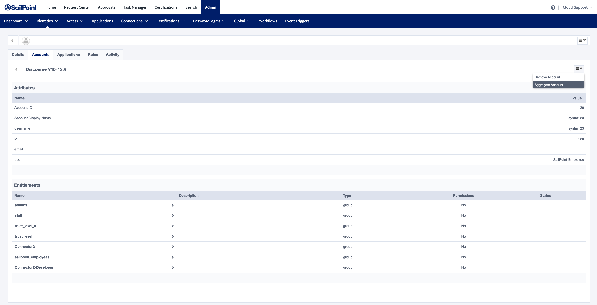

| Input/Output |      Data Type       |
| :----------- | :------------------: |
| Input        | StdAccountReadInput  |
| Output       | StdAccountReadOutput |

### Example StdAccountReadInput

```javascript
"identity": "john.doe",
"key": {
    "simple": {
        "id": "john.doe"
    }
}
```

### Example StdAccountReadOutput

```javascript
{
    "key": {
        "simple": {
            "id": "john.doe"
        }
    },
    "disabled": false,
    "locked": false,
    "attributes": {
        "id": "john.doe",
        "displayName": "John Doe",
        "email": "example@sailpoint.com",
        "entitlements": [
            "administrator",
            "sailpoint"
        ]
    }
}
```

## Description

The account read command aggregates a single account from the target source into IdentityNow. IDN can call this command during a “one-off” account refresh, which you can trigger by aggregating an individual account in IDN.



## Implementation

Implementation of account read is similar to account list's implementation, except the code only needs to get one account, not all the accounts. The following snippet is from [airtable.ts](https://github.com/sailpoint-oss/airtable-example-connector/blob/main/src/airtable.ts):

```javascript
async getAccount(identity: SimpleKeyType | CompoundKeyType): Promise<AirtableAccount> {
    const id = <SimpleKeyType>identity
    let found = false

    return this.airTableBase('Users').select({
        view: 'Grid view',
        filterByFormula: `({Id} = '${id.simple.id}')`
    }).firstPage().then(records => {
        const recordArray: Array<AirtableAccount> = []
        for (const record of records) {
            found = true
            recordArray.push(AirtableAccount.createWithRecords(record))
        }
        return recordArray[0]
    }).catch(err => {
        throw new ConnectorError('error while getting account: ' + err)
    }).finally(() => {
        // if the account is not found, throw the special NotFound error type
        if (!found) {
            throw new ConnectorError("Account not found", ConnectorErrorType.NotFound)
        }
    })
}
```

One special case of this command is the `NotFound` type. On line 20, if an account is not found, the `ConnectorError` is thrown with the `ConnectorErrorType.NotFound` type. This tells IDN the account does not exist, and IDN then triggers the account create logic to generate the account.

The following code snippet from [index.ts](https://github.com/sailpoint-oss/airtable-example-connector/blob/main/src/index.ts) shows how to register the account read command on the connector object:

```javascript
// Connector must be exported as module property named connector
export const connector = async () => {

    // Get connector source config
    const config = await readConfig()

    // Use the vendor SDK, or implement own client as necessary, to initialize a client
    const airtable = new AirtableClient(config)

    return createConnector()
        .stdAccountRead(async (context: Context, input: StdAccountReadInput, res: Response<StdAccountReadOutput>) => {
            const account = await airtable.getAccount(input.key)

            res.send(account.toStdAccountReadOutput())
        })
...
```
