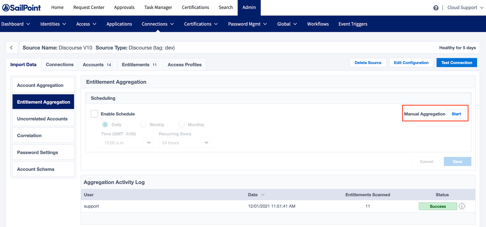

| Input/Output |        Data Type         |
| :----------- | :----------------------: |
| Input        | StdEntitlementListInput  |
| Output       | StdEntitlementListOutput |

### Example StdEntitlementListInput

```javascript
{
    "type": "group"
}
```

### Example StdEntitlementListOutput

```javascript
{
    "identity": "john.doe",
    "key": {
        "simple": {
            "id": "administrator"
        }
    },
    "type": "group",
    "attributes": {
        "id": "administrator",
        "name": "Administrator"
    }
}
```

## Description

The entitlement list command triggers during a manual or scheduled entitlement aggregation operation within ISC. This operation gathers a list of all entitlements available on the target source, usually multi-valued entitlements like groups or roles. This operation provides ISC administrators with a list of entitlements available on the source so they can create access profiles and roles accordingly, and it provides ISC with more details about the entitlements. The entitlement schema’s minimum requirements are name and ID, but you can add other values, such as created date, updated date, status, etc.

To use this command, you must specify this value in the `commands` array: `std:entitlement:list`



## Defining the Schema

The entitlement schema is defined in the [connector-spec.json](https://github.com/sailpoint-oss/airtable-example-connector/blob/main/connector-spec.json) file. Currently, only the multi-valued “group” type is supported. The following values are the minimum requirements, but you can add more attributes.

```javascript
...
"entitlementSchemas": [
 {
  "type": "group",
  "displayAttribute": "name",
  "identityAttribute": "id",
  "attributes": [
   {
    "name": "id",
    "type": "string",
    "description": "Unique ID of the group (ex. admin)"
   },
   {
    "name": "name",
    "type": "string",
    "description": "The display name of the group (ex. Admin)"
   }
  ]
 }
],
...
```

## Implementation

This can be implemented in the main connector file, [index.ts](https://github.com/sailpoint-oss/airtable-example-connector/blob/main/src/index.ts):

```javascript
...
.stdEntitlementList(async (context: Context, input: StdEntitlementListInput, res: Response<StdEntitlementListOutput>) => {
    const groups = await airtable.getAllEntitlements()

    for (const group of groups) {
        res.send(group.toStdEntitlementListOutput())
    }
})
...
...
...
public toStdEntitlementListOutput(): StdEntitlementListOutput {
    return this.buildStandardObject();
}
private buildStandardObject(): StdEntitlementReadOutput | StdEntitlementListOutput {
    return {
        key: SimpleKey(this.id),
        type: 'group',
        attributes: {
            id: this.id,
            name: this.name
        }
    }
}
```

:::caution Important

ISC will throw a connection timeout error if your connector doesn't respond within 3 minutes, and there are memory limitations involved with aggregating data. To prevent large memory utilization or timeout errors, you should set up your connectors to send data to ISC as it's retrieved from your source system. For more details and an example, refer to [Connector Timeouts](../in-depth/connector-timeouts.md).

:::

:::caution Important

ISC supports [delta aggregation](#delta-aggregation-state). If your source has a large number of entitlements that will be syncronized with ISC, then it is highly recommended to utilize [delta aggregation](#delta-aggregation-state) for the source.

:::

## Delta Aggregation (State)

If your source can keep track of changes to the data in some way, then delta aggregation can be performed on a source. In order to implement, there are a few things that need to be configured

1. In your connector-spec.json file, the feature needs to be enabled by adding the following key: `"supportsStatefulCommands": true,` and in the sourceConfig section, a checkbox needs to be added to enable state with the key `spConnEnableStatefulCommands`:

```javascript
"supportsStatefulCommands": true,
...
{
    "key": "spConnEnableStatefulCommands",
    "label": "Stateful",
    "required": true,
    "type": "checkbox"
}
```

2. In the `stdEntitlementList` command, when you are done sending entitlments, you need to also send the state to ISC so it knows where to start the next time it sends a list request:

```javascript
const state = {"data": Date.now().toString()}
...
res.saveState(state)
```

In the above example, I am capturing the date, but you can use any value you want to store the state

:::caution Important

The state that you send using the `saveState` command MUST be a json object, and it is recommend to only save strings to ensure proper serialization/deserialization of the data. You cannot send a simple string or number or it will not properly save the state.

:::

3. In the `stdEntitlementList` command, you need to properly handle the state object. Something like below checks the stateful boolean as well as the state object and fetches accounts accordingly:

```javascript
.stdEntitlementList(async (context: Context, input: StdEntitlementListInput, res: Response<StdEntitlementListOutput>) => {
    let groups = []
    const state = {"data": Date.now().toString()}
    if (!input.state && input.stateful) {
        logger.info(input, "No state provided, fetching all entitlements")
        const groups = await airtable.getAllEntitlements()
    } else if (input.state && input.stateful) {
        logger.info(input ,"Current state provided, only fetching entitlements after that state")
        const groups = await airtable.getAllStatefulEntitlements(new Date(Number(input.state?.data)))
    } else {
        logger.info(input.state ,"Source is not stateful, getting all entitlements")
        const groups = await airtable.getAllEntitlements()
    }
    logger.info(groups, "fetched the following entitlements in Airtable")
    for (const group of groups) {
        res.send(group.toStdEntitlementListOutput())
    }
    res.saveState(state)
})
```
