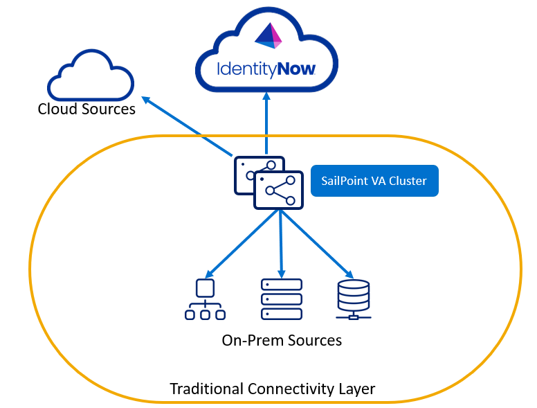

SaaS Connectivity is a cloud based connector runtime that makes developing and deploying web service connectors easier than Connector 1.0 does. However, because the cloud hosts SaaS Connectivity, not a Virtual Appliance (VA), SaaS Connectivity is limited in the types of applications it can connect to. For example, you cannot use SaaS Connectivity to connect to on-prem services that can only communicate within an intranet (no public internet access). This excludes JDBC and Mainframe applications, to name a few.

## What Are Connectors

Connectors are the bridges between the SailPoint Identity Now (IDN) SaaS platform and the source systems that IDN needs to communicate with and aggregate data from. An example of a source system IDN may need to communicate with would be an Oracle HR system or GitHub. In these cases, IDN synchronizes data between systems to ensure account entitlements and state are correct through the organization.

## Why We Are Introducing SaaS Connectivity

The primary driver for indroducing the SaaS Connectivity framework is to allow a way to connect to other cloud based sources in a truly SaaS architecture, without the need to rely on a VA. There are also other benefits that come with the SaaS Connectivity framework:
 - Ability to develop, debug and test custom connectors locally without any dependencies on IdentityNow
 - Features to customize the user interface when configuring the connector that are specific to the source
 - Support for more modern languages and frameworks

## Architecture of SaaS Connectivity

VA connectors always communicate with external sources through the Virtual Appliance (VA) as seen in the diagram below:



The new Cloud connectors work differently - they run on the IDN platform instead:


With both SaaS connectivity and traditional VA connectivity in place, you can have the best of both worlds. Below is a new diagram showing both of them working together to leverage both on-prem and cloud based sources.


## Connectivity Encryption

Any direct connectors that specify a virtual appliance (VA) use [Zero Knowledge Encryption](https://community.sailpoint.com/t5/Lighthouse/Protecting-Sensitive-Data-with-Zero-Knowledge-Encryption/ta-p/79657?attachment-id=452) schemes with an RSA 2048-bit asymmetric key pair: there is a private key on the VA for decryption and a public key in the cloud (as part of the VA cluster) for encryption.

SaaS connectors cannot operate the same way because they do not communicate through VA clusters. Despite this, SaaS connectors can still leverage the asymmetric key pair scheme — the key pair simply resides in the cloud instead of on the VA. The key pair is only accessible to the Connectivity service and is managed to SailPoint standards for credential storage. Whenever you are storing secret data, use the ```secret``` or ```secrettextarea``` field types.
