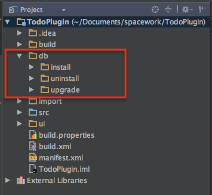

# Database Scripts

Plugins that require persistence of data outside of that allowed by the IdentityIQ object model will require at minimum the creation, updating, and deletion of unique tablespace. For this purpose, the plugin framework introduced in IdentityIQ 7.1 has created a new database, appropriately named 'identityiqPlugin'. The creation of this database is handled by the installation scripts packaged with every download of IdentityIQ, in the WEB-INF/database folder. Additionally, a default user 'identityiqPlugin' is also created to perform operations (installation and deletion of plugins) on this new database. Similar to the base IdentityIQ username and password, these can be modified and updated in the IdentityIQ iiq.properties file located in WEB-INF/classes/iiq.properties.

For plugin creation, a folder should be created called 'db' in your project directory. This folder should be further subdivided into three operation specific folders: install, uninstall, and upgrade.

The scripts placed in these folders are automatically ran when a plugin is installed via the UI, or deleted via the UI. It is recommended that developers include scripts for the four major database types supported by IdentityIQ (MySQL, SQLServer, DB2, and Oracle) - or note in their documentation which databases are supported. The 'upgrade' folder should contain any deltas in table definitions from prior versions of the plugin.