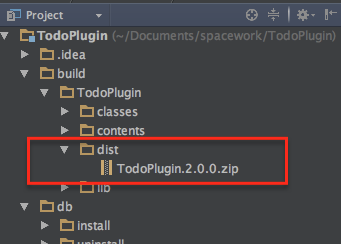

# Plugin Installation

Plugin installation is simple in IdentityIQ 7.1. Simply navigate to Settings -> Plugins, and then click the 'New' button

Doing this will create a view with a large element that allows for drag and drop installation. Drag the .zip archive of your plugin to this element and the Plugin will install. If any errors occur during this process, check the SyslogEvent table for more information.

But wait, where do I get the .zip archive? If you have downloaded a published plugin from SailPoint, the .zip file should be included with the download. If you have developed the plugin yourself, the .zip file will be the result of executing the build process against your project. Using the build file outlined in this guide as an example, the .zip archive will be created in your project directory under 'build/<your plugin name/>/dist' after executing the 'ant build' command.

When a plugin is installed, the database scripts from the 'db/install' folder are ran, which should create any tables necessary for the plugin, the XML configuration files are imported into the IdentityIQ database from the 'import/install' folder, and any compiled classes are loaded into the unique plugin classloader, and the manifest file is imported creating the Plugin object.

Uninstallation follows a very similar path, it is launched by clicking the small 'X' icon on the appropriate Plugin card in the 'Settings->Plugin' interface. Database scripts in charge of cleaning up data are ran from the 'db/uninstall' folder, and the Manifest file (the Plugin object) is removed. It should be noted that the other XML objects created during installation are currently *not* uninstalled when a Plugin is removed.

